# ☁️ AWS DevOps Capstone Project
> 🚀 End-to-end AWS DevOps project demonstrating Infrastructure as Code, CI/CD automation, Docker containerization, centralized monitoring, Amazon RDS integration, and automated database backups to Amazon S3. 


--- 

## 📖 Project Overview

This project demonstrates a complete end-to-end DevOps implementation on AWS using Infrastructure as Code (CloudFormation), Continuous Integration and Continuous Deployment (CI/CD), Docker containerization, centralized monitoring, and automated database backup.

The infrastructure is provisioned using modular CloudFormation templates. A Jenkins pipeline automates the build, testing, Docker image creation, and deployment of a Spring Boot application running on an Amazon EC2 instance. The application uses Amazon RDS MySQL for persistent storage, while Prometheus and Grafana provide real-time monitoring and visualization.

To improve operational reliability, an automated backup solution periodically creates compressed MySQL database backups and securely uploads them to Amazon S3 using an IAM role attached to the EC2 instance.

The project follows DevOps best practices by combining Infrastructure as Code, automation, monitoring, containerization, and cloud-native services into a single production-style deployment.

---

## 🎯 Objectives

- Provision AWS infrastructure using CloudFormation
- Deploy a Dockerized Spring Boot application
- Automate CI/CD using Jenkins
- Store application data in Amazon RDS MySQL
- Monitor infrastructure and applications using Prometheus and Grafana
- Automate RDS database backups to Amazon S3
- Apply IAM least-privilege access for secure AWS operations
- Demonstrate a production-style DevOps workflow

---

## 📌 Project Highlights

- Designed and deployed AWS infrastructure using **5 modular CloudFormation templates**.
- Automated build and deployment with a Jenkins Declarative Pipeline.
- Containerized a Spring Boot application using Docker.
- Integrated Amazon RDS MySQL as the application database.
- Configured Prometheus and Grafana for monitoring.
- Automated scheduled database backups to Amazon S3 using Bash and Cron.
- Secured AWS access using IAM Roles instead of static credentials.

## ✨ Key Features

| Feature | Description |
|----------|-------------|
| ☁️ **Infrastructure as Code** | Provisioned the complete AWS infrastructure using modular CloudFormation templates, including VPC, Security Groups, EC2, RDS, and S3. |
| 🚀 **CI/CD Pipeline** | Implemented a Jenkins Declarative Pipeline to automate source checkout, Maven build, testing, Docker image creation, Docker Hub push, deployment, and application health verification. |
| 🐳 **Containerized Deployment** | Packaged the Spring Boot application into a Docker container for consistent and repeatable deployments. |
| 🗄️ **Managed Database** | Configured Amazon RDS MySQL as the backend database with secure network access through dedicated security groups. |
| 💾 **Automated Database Backup** | Developed a Bash script that performs scheduled MySQL backups, compresses the dump, and uploads it automatically to Amazon S3. |
| 🔐 **Secure AWS Access** | Attached an IAM Role to the EC2 instance to provide secure, temporary credentials for S3 access without storing AWS access keys. |
| 📊 **Infrastructure Monitoring** | Deployed Prometheus and Node Exporter to collect application and system metrics in real time. |
| 📈 **Visualization Dashboard** | Created Grafana dashboards to visualize JVM memory, CPU usage, HTTP requests, application uptime, and system health. |
| ❤️ **Application Health Monitoring** | Enabled Spring Boot Actuator endpoints for health checks and Prometheus metrics collection. |
| ⚡ **Automation** | Automated recurring database backups using Linux Cron Jobs, reducing manual operational effort. |

---

## 🛠️ Technology Stack

| Category | Technologies |
|-----------|--------------|
| **Cloud Platform** | AWS |
| **Infrastructure as Code** | AWS CloudFormation |
| **Compute** | Amazon EC2 |
| **Database** | Amazon RDS MySQL |
| **Storage** | Amazon S3 |
| **CI/CD** | Jenkins |
| **Containerization** | Docker, Docker Hub |
| **Application** | Spring Boot, Maven |
| **Monitoring** | Prometheus, Node Exporter, Grafana |
| **Operating System** | Ubuntu Server 24.04 LTS |
| **Scripting** | Bash |
| **Version Control** | Git, GitHub |
| **Scheduling** | Cron |

---

## 🏗️ Solution Architecture

This project follows a production-inspired DevOps architecture where infrastructure provisioning, application deployment, monitoring, and operational tasks are automated using AWS services and industry-standard DevOps tools.

The infrastructure is provisioned using AWS CloudFormation, application deployment is automated through a Jenkins CI/CD pipeline, monitoring is implemented using Prometheus and Grafana, and scheduled database backups are securely stored in Amazon S3.

---

## 🖼️ Solution Architecture Diagram

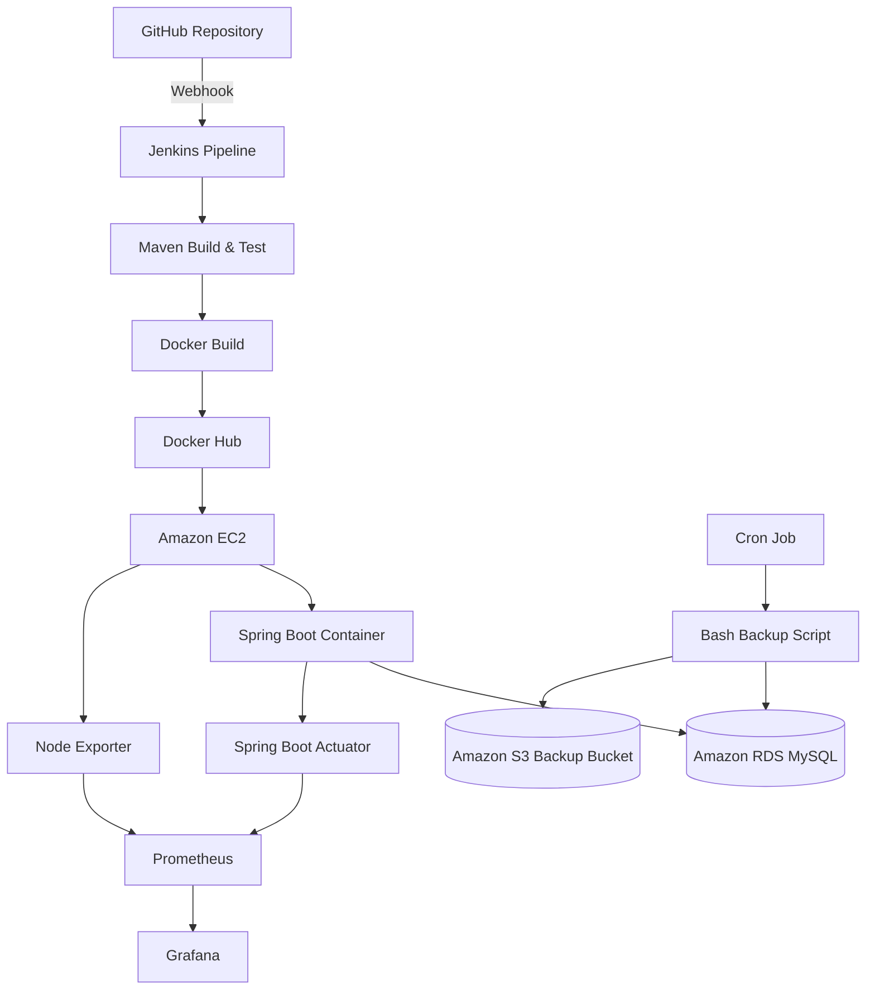


---

## ☁️ AWS Services Used

| AWS Service | Purpose |
|-------------|---------|
| **Amazon EC2** | Hosts the Dockerized Spring Boot application along with Jenkins, Prometheus, Grafana, and Node Exporter. |
| **Amazon RDS MySQL** | Provides managed relational database services for persistent application data. |
| **Amazon S3** | Stores compressed database backup files generated by the automated backup script. |
| **AWS IAM** | Provides secure authentication through IAM Roles, eliminating the need for static AWS access keys. |
| **Amazon VPC** | Provides network isolation for the application infrastructure. |
| **Security Groups** | Control inbound and outbound network traffic between AWS resources. |
| **AWS CloudFormation** | Automates infrastructure provisioning using Infrastructure as Code (IaC). |

---

## 📂 Repository Structure

```text
devops_capstone_project/
│
├── app/
│   ├── src/
│   ├── pom.xml
│   ├── Dockerfile
│   └── target/
│
├── cloudformation/
│   ├── network.yaml
│   ├── security-groups.yaml
│   ├── ec2.yaml
│   ├── database.yaml
│   ├── s3.yaml
│   ├── parameters.json
│   └── README.md
│
├── docs/
│   └── screenshots/
│
├── monitoring/
│   └── grafana/
│
├── scripts/
│   └── rds_backup.sh
│
├── Dockerfile
├── Jenkinsfile
├── README.md
└── .gitignore
```

---

## 🔄 End-to-End Workflow

The complete deployment workflow is as follows:

1. Source code is pushed to the GitHub repository.
2. Jenkins automatically checks out the latest source code.
3. Maven compiles and packages the Spring Boot application.
4. Docker builds the application image.
5. The Docker image is pushed to Docker Hub.
6. Jenkins deploys the latest container to the Amazon EC2 instance.
7. The Spring Boot application establishes a secure connection with Amazon RDS MySQL.
8. Prometheus continuously collects infrastructure and application metrics.
9. Grafana visualizes these metrics through real-time dashboards.
10. A scheduled Cron Job executes the automated database backup script.
11. The backup script generates a compressed MySQL database dump.
12. The compressed backup is securely uploaded to Amazon S3 using the EC2 IAM Role.

---

> **The next section explains how the AWS infrastructure is provisioned using CloudFormation templates and how the CI/CD pipeline automates application deployment.**

## ☁️ Infrastructure Provisioning with AWS CloudFormation

The complete AWS infrastructure for this project is provisioned using **AWS CloudFormation**, enabling Infrastructure as Code (IaC). Instead of creating AWS resources manually, reusable CloudFormation templates automate the deployment process, ensuring consistency, repeatability, and easier infrastructure management.

The infrastructure has been divided into modular templates, where each template is responsible for provisioning a specific set of AWS resources. This modular approach simplifies maintenance, debugging, and future enhancements.

---

## 📦 CloudFormation Templates

| Template | Purpose |
|----------|---------|
| **network.yaml** | Creates the VPC, public and private subnets, Internet Gateway, Route Tables, and networking resources. |
| **security-groups.yaml** | Creates Security Groups for EC2, Amazon RDS, and application communication. |
| **ec2.yaml** | Provisions the Ubuntu EC2 instance, IAM Role, Instance Profile, and initial software configuration. |
| **database.yaml** | Creates the Amazon RDS MySQL database instance. |
| **s3.yaml** | Creates the Amazon S3 bucket used for automated database backups. |

---

## 🚀 Infrastructure Deployment Sequence

The infrastructure is deployed in the following order:

```text
Network
     │
     ▼
Security Groups
     │
     ▼
Amazon EC2
     │
     ▼
Amazon RDS
     │
     ▼
Amazon S3
```

This deployment sequence ensures that networking resources and security components are available before compute and database resources are provisioned.

---

## 🔐 Security Implementation

The infrastructure follows AWS security best practices by implementing:

- IAM Role attached to the EC2 instance
- Security Group-based network isolation
- Private communication between EC2 and Amazon RDS
- Secure access to Amazon S3 using IAM Roles
- No hardcoded AWS Access Keys
- Principle of Least Privilege for AWS permissions

---

## 🚀 Continuous Integration & Continuous Deployment (CI/CD)

Application deployment is fully automated using a **Jenkins Declarative Pipeline**. Every pipeline execution follows a predefined sequence that validates the application, builds the Docker image, and deploys the latest version.

---

## 🔄 CI/CD Workflow

```text
GitHub
   │
   ▼
Jenkins
   │
   ▼
Checkout Source Code
   │
   ▼
Maven Build
   │
   ▼
Run Tests
   │
   ▼
Build Docker Image
   │
   ▼
Push Image to Docker Hub
   │
   ▼
Deploy Container on EC2
   │
   ▼
Application Health Check
```

---

## ⚙️ Jenkins Pipeline Stages

| Stage | Description |
|--------|-------------|
| **Checkout** | Retrieves the latest application source code from GitHub. |
| **Build** | Compiles the Spring Boot application using Maven. |
| **Test** | Executes automated tests before deployment. |
| **Docker Build** | Builds the Docker image from the application source code. |
| **Docker Push** | Pushes the latest Docker image to Docker Hub. |
| **Deployment** | Pulls and deploys the latest Docker image on the EC2 instance. |
| **Health Verification** | Verifies the deployed application using the Spring Boot Actuator health endpoint. |

---

## ✅ Benefits of the CI/CD Pipeline

- Automated application deployment
- Consistent build process
- Reduced manual intervention
- Faster release cycles
- Repeatable deployments
- Improved deployment reliability
- Automated post-deployment validation

---

> **The next section explains how Docker, Prometheus, Grafana, and the automated backup solution work together to monitor and maintain the deployed application.**

## 🐳 Docker Containerization

The Spring Boot application is containerized using **Docker**, ensuring a consistent runtime environment across development, testing, and production. By packaging the application and its dependencies into a Docker image, deployments become faster, more reliable, and independent of the underlying operating system.

The Docker image is built automatically as part of the Jenkins CI/CD pipeline, pushed to Docker Hub, and deployed on the Amazon EC2 instance.

---

## 📦 Docker Deployment Workflow

```text
Spring Boot Source Code
          │
          ▼
      Maven Build
          │
          ▼
     JAR File Created
          │
          ▼
      Docker Build
          │
          ▼
     Docker Image
          │
          ▼
    Docker Hub Repository
          │
          ▼
 Amazon EC2 Instance
          │
          ▼
 Running Docker Container
```

---

## ⚙️ Docker Implementation

The containerization process includes the following steps:

- Build the Spring Boot application using Maven.
- Generate the executable JAR file.
- Build a Docker image using the project's Dockerfile.
- Push the Docker image to Docker Hub.
- Pull and deploy the latest image on the Amazon EC2 instance.
- Run the application as a Docker container.

---

## ✅ Benefits of Docker

- Consistent deployment across environments
- Lightweight and portable application packaging
- Simplified application deployment
- Easy rollback to previous versions
- Faster deployment process
- Reduced environment-specific issues

---

## 📊 Monitoring with Prometheus

Application and infrastructure monitoring is implemented using **Prometheus**. It continuously collects metrics from both the EC2 instance and the Spring Boot application, providing real-time visibility into system health and application performance.

Prometheus works together with **Node Exporter** and **Spring Boot Actuator** to collect infrastructure and application metrics, which are then visualized using Grafana dashboards.

---

## 📈 Monitoring Architecture

```text
          Amazon EC2
               │
      ┌────────┴────────┐
      │                 │
      ▼                 ▼
Node Exporter   Spring Boot Actuator
      │                 │
      └────────┬────────┘
               ▼
         Prometheus Server
               │
               ▼
        Grafana Dashboard
```

---

## 📊 Metrics Collection

Prometheus collects metrics from the following sources:

| Source | Metrics Collected |
|--------|-------------------|
| **Node Exporter** | CPU Usage, Memory Usage, Disk Usage, Network Traffic, File System Metrics |
| **Spring Boot Actuator** | JVM Memory, JVM Threads, HTTP Requests, Application Uptime, Health Metrics |

---

## 🎯 Monitoring Benefits

- Real-time infrastructure monitoring
- Application performance tracking
- Centralized metrics collection
- Early detection of performance issues
- Historical metric analysis
- Integration with Grafana dashboards

---

## 📈 Visualization with Grafana

Grafana is integrated with Prometheus to provide real-time visualization of infrastructure and application metrics through interactive dashboards. It enables quick identification of performance trends, resource utilization, and potential issues affecting the application.

The dashboards are configured using Prometheus as the data source, allowing live monitoring of both system-level and application-level metrics.

---

## 📊 Dashboard Metrics

The Grafana dashboard visualizes the following key metrics:

| Category | Metrics |
|----------|---------|
| **System Metrics** | CPU Usage, Memory Usage, Disk Usage, Network Traffic |
| **Application Metrics** | JVM Memory Usage, JVM Thread Count, Application Uptime |
| **HTTP Metrics** | HTTP Request Count, Response Status, Request Rate |
| **Infrastructure Metrics** | Node Exporter Metrics, System Load, File System Usage |

---

## 📈 Benefits of Grafana Dashboards

- Real-time infrastructure monitoring
- Centralized visualization of application metrics
- Easy identification of performance bottlenecks
- Historical trend analysis
- Improved operational visibility
- Better troubleshooting and performance analysis

---

## ❤️ Spring Boot Health Monitoring

The application exposes health and monitoring endpoints using **Spring Boot Actuator**, enabling continuous health verification and seamless integration with Prometheus.

These endpoints provide detailed information about the application's operational status and its dependencies, helping ensure that the application is functioning correctly after deployment.

---

## 🔍 Health Endpoint

The project uses the following endpoint to verify application health:

```text
GET /actuator/health
```

A successful response confirms that:

- The Spring Boot application is running successfully.
- The Amazon RDS MySQL database connection is healthy.
- Disk space is within acceptable limits.
- The application is in a ready and live state.
- Overall application status is **UP**.

---

## ✅ Health Verification

The health endpoint is used to:

- Validate successful application deployment.
- Verify database connectivity.
- Confirm application readiness.
- Support troubleshooting and operational monitoring.
- Ensure reliable application availability after deployment.

---

## 💾 Automated Database Backup to Amazon S3

To improve operational reliability and support disaster recovery, an automated database backup solution has been implemented. The solution periodically creates a compressed backup of the Amazon RDS MySQL database and securely uploads it to an Amazon S3 bucket.

The entire backup process is fully automated using a custom Bash script and a Linux Cron Job, eliminating the need for manual intervention.

---

## 🔄 Backup Workflow

```text
Amazon RDS MySQL
        │
        ▼
mysqldump
        │
        ▼
SQL Database Dump
        │
        ▼
Gzip Compression
        │
        ▼
Bash Backup Script
        │
        ▼
Amazon S3 Backup Bucket
```

---

## ⚙️ Backup Process

The backup automation performs the following steps:

1. Connects securely to the Amazon RDS MySQL database.
2. Generates a timestamped SQL database dump using `mysqldump`.
3. Compresses the backup file using `gzip`.
4. Uploads the compressed backup to the designated Amazon S3 bucket.
5. Logs the backup execution for verification and troubleshooting.

---

## ⏰ Scheduled Automation

A Linux Cron Job is configured to execute the backup script automatically at the scheduled time every day.

This automation ensures that database backups are created consistently without requiring manual execution.

### Benefits

- Automated daily backups
- Reduced operational effort
- Consistent backup schedule
- Reliable disaster recovery
- Cloud-based backup storage
- Easy backup verification

---

## 🔐 Security Best Practices

The backup solution follows AWS security best practices by implementing:

- IAM Role attached to the EC2 instance for AWS authentication
- No hardcoded AWS Access Keys
- Least-Privilege IAM permissions for Amazon S3 access
- Secure communication with AWS services over HTTPS
- Timestamped backup files to prevent accidental overwrites

---

## ✅ Backup Validation

The backup solution was successfully validated by verifying that:

- The backup script executes without errors.
- A compressed SQL backup file is generated successfully.
- The backup file is uploaded to the configured Amazon S3 bucket.
- Multiple backup files are retained in the S3 bucket for recovery purposes.
- The Cron Job is configured to automate future backups.

---

## 📸 Project Validation & Screenshots

The following screenshots demonstrate the successful implementation, deployment, monitoring, and validation of the complete DevOps solution.

Each screenshot represents a key stage of the project and verifies that the corresponding AWS service or DevOps component is functioning as expected.

---

## 1️⃣ AWS CloudFormation Stacks

The infrastructure was successfully provisioned using modular AWS CloudFormation templates. The following screenshot confirms that all CloudFormation stacks were created successfully.

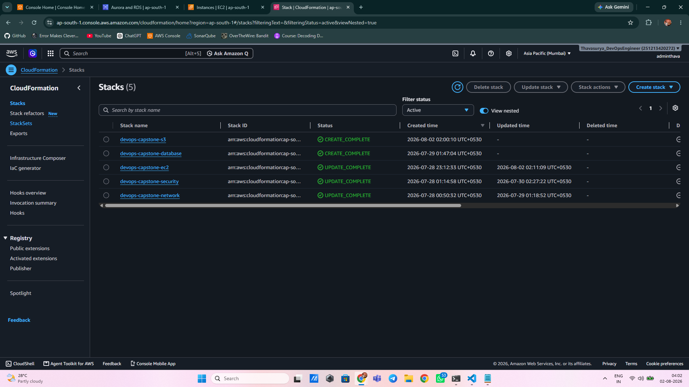

---

## 2️⃣ Amazon EC2 Instance

The Amazon EC2 instance hosts the Spring Boot application along with Jenkins, Prometheus, Grafana, and Node Exporter.

The screenshot below confirms that the EC2 instance is running successfully.

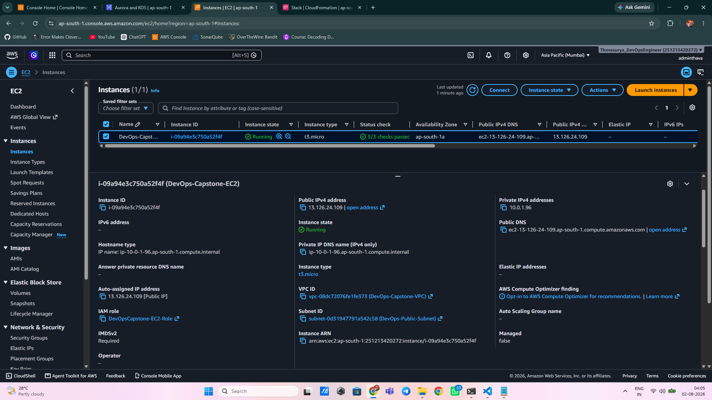

---

## 3️⃣ Amazon RDS MySQL

Amazon RDS MySQL serves as the backend database for the application.

The following screenshot verifies that the database instance is available and configured successfully.

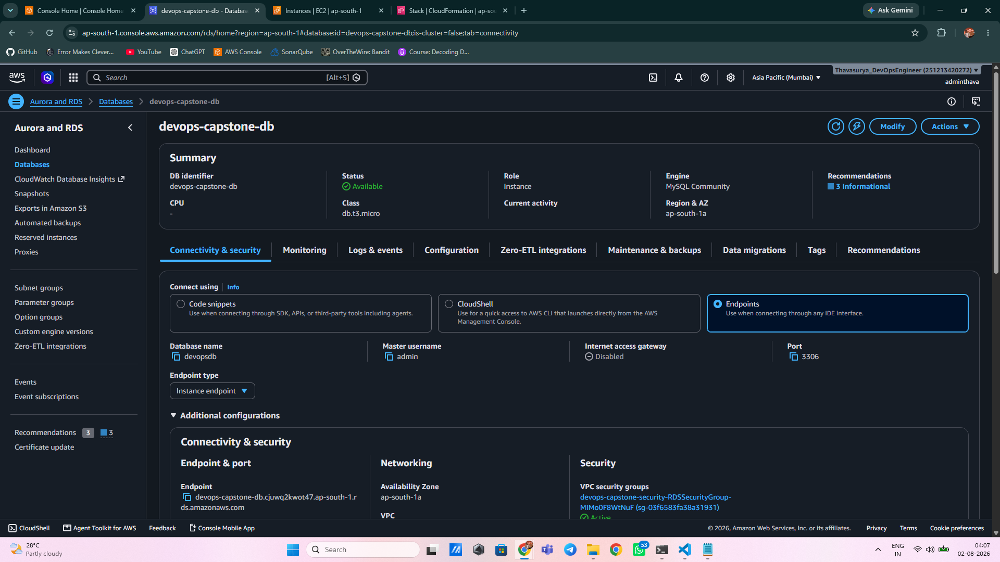

---

## 4️⃣ Amazon S3 Backup Bucket

The automated database backup solution uploads compressed backup files to an Amazon S3 bucket for secure storage and disaster recovery.

The screenshot below confirms that the backup bucket has been created successfully.

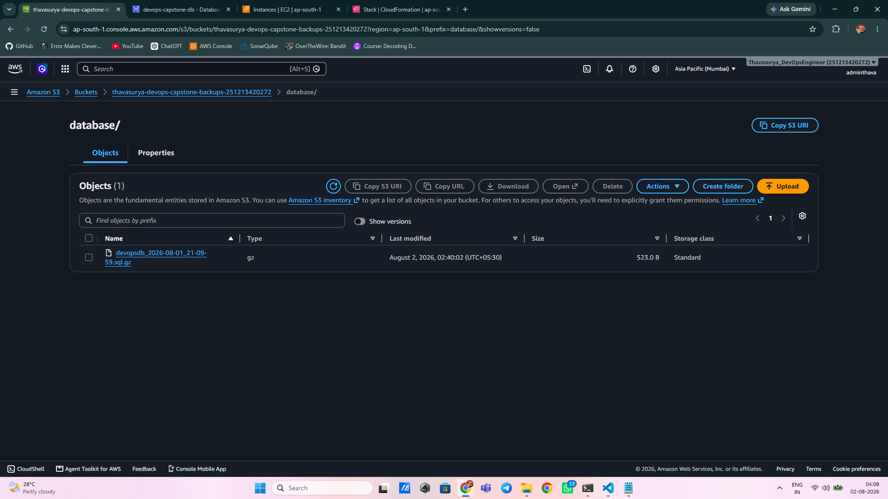

---

## 5️⃣ GitHub Repository

The complete project source code, CloudFormation templates, Jenkins pipeline, automation scripts, and documentation are maintained in a GitHub repository.

The following screenshot shows the repository structure.

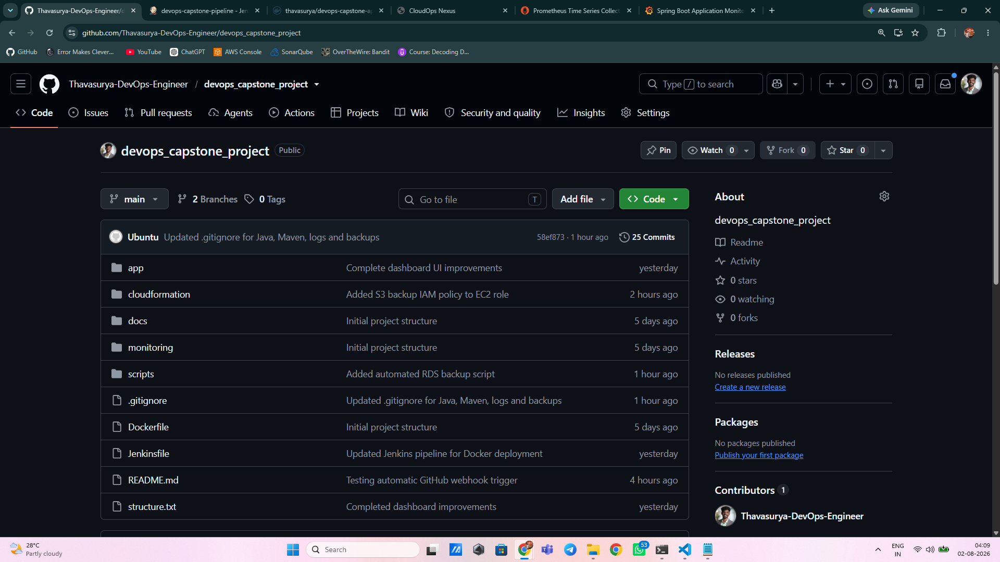

---

## 6️⃣ Jenkins CI/CD Pipeline

The Jenkins Declarative Pipeline automates application build, testing, Docker image creation, deployment, and application verification.

The screenshot below shows a successful pipeline execution.

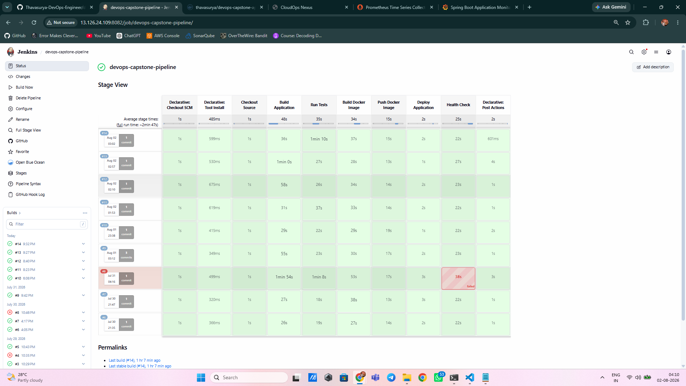

---

## 7️⃣ Docker Containers

The deployed application and supporting monitoring services are running successfully as Docker containers on the Amazon EC2 instance.

The following screenshot verifies the running containers.

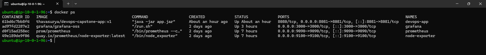

---

## 8️⃣ Prometheus Monitoring

Prometheus continuously collects infrastructure and application metrics from the EC2 instance and the Spring Boot application.

The following screenshot confirms that all configured targets are successfully discovered and monitored.

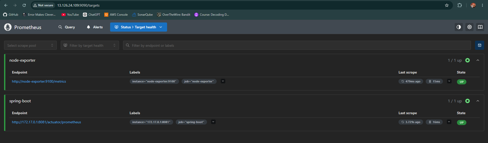

---

## 9️⃣ Grafana Dashboard

Grafana provides real-time visualization of infrastructure and application metrics collected by Prometheus.

The dashboard includes CPU utilization, memory usage, JVM metrics, HTTP requests, uptime, and other operational insights.

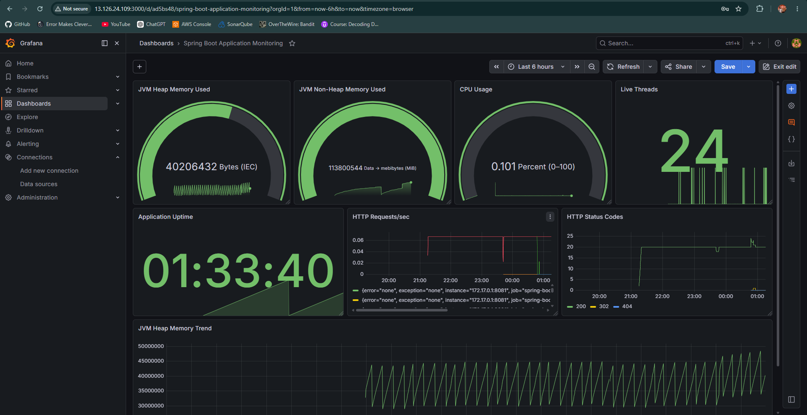

---

## 🔟 Spring Boot Health Endpoint

Spring Boot Actuator exposes a health endpoint that verifies the operational status of the application and its dependencies.

The following screenshot confirms that the application and database are healthy.

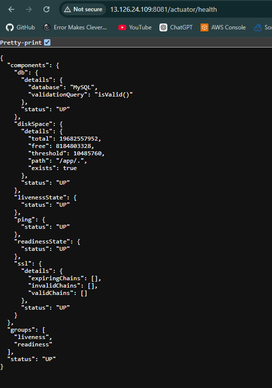

---

## 1️⃣1️⃣ Automated Database Backup

A custom Bash script performs automated MySQL database backups and uploads the compressed backup files to Amazon S3.

The following screenshot shows a successful execution of the backup script.

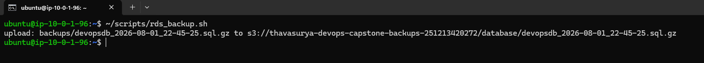

---

## 1️⃣2️⃣ Amazon S3 Backup Verification

The uploaded database backup files are successfully stored in the configured Amazon S3 bucket.

The screenshot below confirms that multiple backup files are available for recovery.

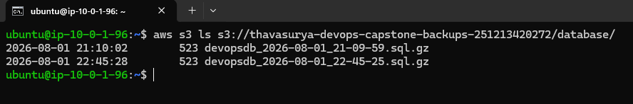

---

## 1️⃣3️⃣ Spring Boot Application Dashboard

The deployed Spring Boot application is successfully accessible through the Amazon EC2 instance.

The following screenshot shows the application's web interface after deployment.

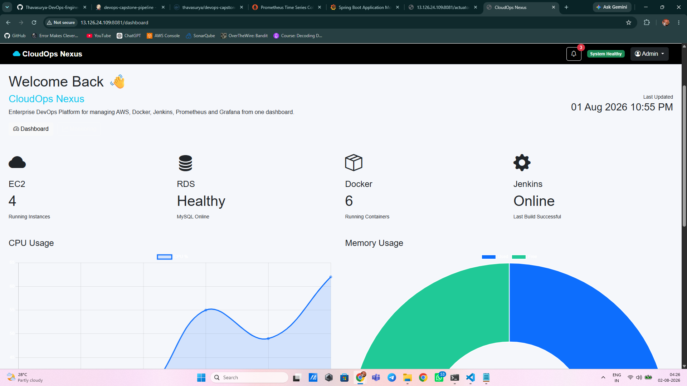

---

## 1️⃣4️⃣ Automated Cron Job

Database backups are executed automatically using a scheduled Linux Cron Job.

The following screenshot verifies that the backup script is configured to run automatically.

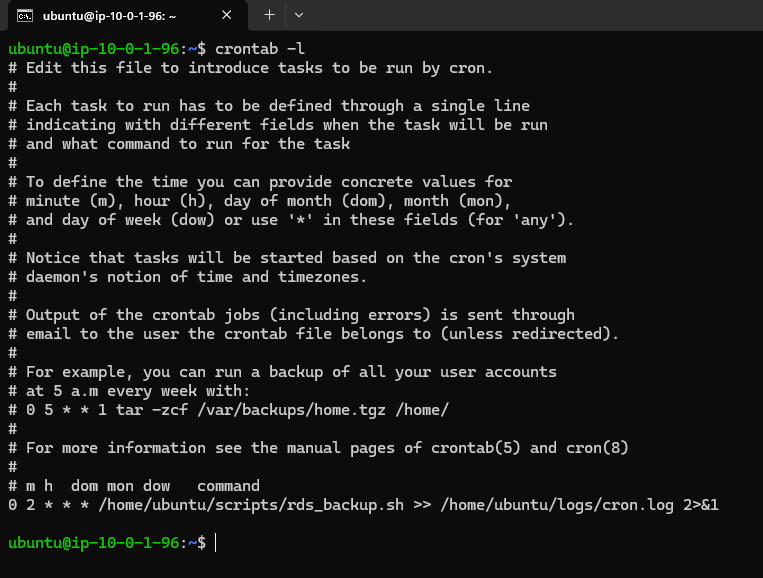

---

## ✅ Project Validation Summary

The completed implementation successfully demonstrates:

- ✅ AWS infrastructure provisioned using modular CloudFormation templates.
- ✅ Spring Boot application deployed as a Docker container on Amazon EC2.
- ✅ Automated CI/CD pipeline implemented using Jenkins.
- ✅ Amazon RDS MySQL integrated as the backend database.
- ✅ Real-time infrastructure and application monitoring using Prometheus.
- ✅ Interactive Grafana dashboards for operational visibility.
- ✅ Spring Boot Actuator health endpoint for deployment validation.
- ✅ Automated MySQL database backups using Bash and Cron.
- ✅ Secure backup storage in Amazon S3.
- ✅ IAM Role-based authentication without storing AWS access keys.

This validation confirms that the complete DevOps workflow—from infrastructure provisioning and application deployment to monitoring, health verification, and disaster recovery—has been successfully implemented and tested.

---

## 🚀 Deployment Guide

The following steps can be used to deploy the project in a new AWS environment.

## Prerequisites

Before deployment, ensure the following are available:

- AWS Account
- AWS CLI configured
- Git
- Docker
- Jenkins
- Maven
- Java 21
- Ubuntu Server 24.04 LTS

---

## Deployment Steps

1. Clone the repository.

```bash
git clone https://github.com/Thavasurya-DevOps-Engineer/aws-devops-capstone-project.git
cd aws-devops-capstone-project
```

2. Deploy the AWS infrastructure using the CloudFormation templates.

3. Configure the required parameters for networking, security groups, EC2, Amazon RDS, and Amazon S3.

4. Build the Spring Boot application using Maven.

```bash
mvn clean package
```

5. Build the Docker image.

```bash
docker build -t devops-capstone-app .
```

6. Push the Docker image to Docker Hub.

7. Deploy the Docker container on the Amazon EC2 instance.

8. Configure Prometheus and Grafana.

9. Verify the application using:

```text
/actuator/health
```

10. Configure the automated database backup Cron Job.

---

## 🎯 Skills Demonstrated

This project demonstrates practical experience with the following technologies and DevOps practices:

### Cloud

- Amazon EC2
- Amazon RDS
- Amazon S3
- Amazon VPC
- AWS IAM
- AWS CloudFormation

### DevOps

- Infrastructure as Code (IaC)
- Continuous Integration
- Continuous Deployment
- Docker Containerization
- Git & GitHub
- Jenkins Automation

### Monitoring

- Prometheus
- Grafana
- Spring Boot Actuator
- Node Exporter

### Automation

- Bash Scripting
- Linux Cron Jobs
- Database Backup Automation

### Development

- Spring Boot
- Maven
- MySQL

---

## 🔮 Future Enhancements

The following improvements can be implemented to further enhance the project:

- Deploy the application on Kubernetes (Amazon EKS)
- Replace CloudFormation with Terraform
- Integrate GitHub Actions alongside Jenkins
- Configure HTTPS using an Application Load Balancer and AWS Certificate Manager
- Store sensitive credentials in AWS Secrets Manager
- Configure Auto Scaling for the application
- Implement centralized logging using the ELK Stack or Amazon CloudWatch Logs
- Configure automated backup lifecycle policies for Amazon S3

---

## 👨‍💻 Author

**Thavasurya S**

**System Engineer | AWS & DevOps Enthusiast**

- GitHub: https://github.com/Thavasurya-DevOps-Engineer
- LinkedIn: https://www.linkedin.com/in/thavasurya-sekar12/

---

## 🙏 Acknowledgements

This project was developed as part of my hands-on DevOps learning journey to gain practical experience with AWS Cloud, Infrastructure as Code, CI/CD automation, containerization, monitoring, and cloud operations.

It reflects the implementation of production-inspired DevOps practices using AWS services and open-source tools.

---

⭐ If you found this project helpful, consider giving the repository a star.
